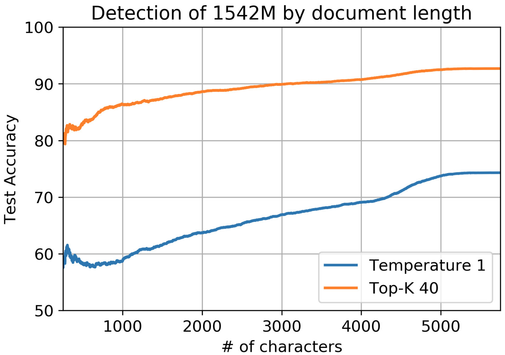
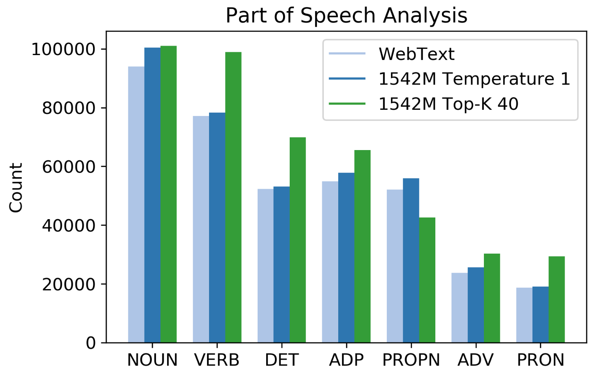
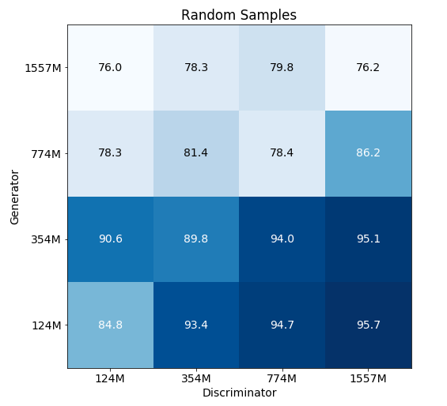
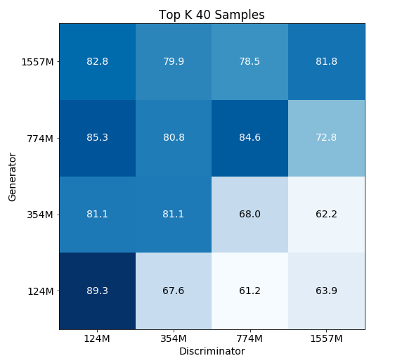

We encourage you to try improving our baselines.  Please let us know if you have questions or find any interesting results!

## Simple baseline

We've provided a starter baseline which trains a logistic regression detector on TF-IDF unigram and bigram features, in [`baseline.py`](./baseline.py).

### Initial Analysis

The baseline achieves the following accuracies:

| Model | Temperature 1 | Top-K 40 |
| ----- | ------ | ------ |
| 117M  | 88.29% | 96.79% |
| 345M  | 88.94% | 95.22% |
| 762M  | 77.16% | 94.43% |
| 1542M | 74.31% | 92.69% |

Unsurprisingly, shorter documents are harder to detect and performance improves gradually with length. Accuracy of detection of short documents of 500 characters (a long paragraph) is about 15% lower.

Truncated sampling, which is commonly used for high-quality generations from the GPT-2 model family, results in a shift in the part of speech distribution of the generated text compared to real text. A clear example is the underuse of proper nouns and overuse of pronouns which are more generic. This shift contributes to the 8% to 18% higher detection rate of Top-K samples compared to random samples across models.

### Finetuning

When run on samples from the finetuned GPT-2 full model, detection rate falls from 92.7% to 70.2% for Top-K 40 generations.  Note that about half of this drop is accounted for by length, since Amazon reviews are shorter than WebText documents.

## "Zero-shot" baseline

We attempt a second baseline which uses a language model to evaluate total log probability, and thresholds based on this probability.  This baseline underperforms relative to the simple baselinie.  However, we are interested in further variants, such as binning per-token log probabilities.

### Initial analysis

Here, we show results of log-prob based detection for both standard (t=1) and Top-K 40 generations.

The main result is that GPT-2 detects itself 81.8% of the time in the easy case of Top-K 40 generations. This is pretty constant across model sizes.  All underperform relative to the simple baseline.

For random samples, results are unsurprising. Bigger models are better able to realize that generated text is still kind of weird and "random". Detection rates also go down as generators get better.

For Top-K 40, results are perhaps more surprising. Using a bigger model as a discriminator does not really improve detection rates across the board (the smallest GPT-2 model does as well at detecting full GPT-2 as full GPT-2), and a bigger model does not "detect down well" - that is, full GPT-2 is actually kind of bad at detecting an adversary using small GPT-2.

An important difference is that while in the random samples case, generations are less likely than real data, in the Top-K 40 case, they are more likely.

### Finetuning

When detecting samples from our finetuned GPT-2 full model using GPT-2 full, we observe a 63.2% detection rate on random samples (drop of 13%) and 76.2% detection rate with Top-K 40 samples (drop of 5.6%)
